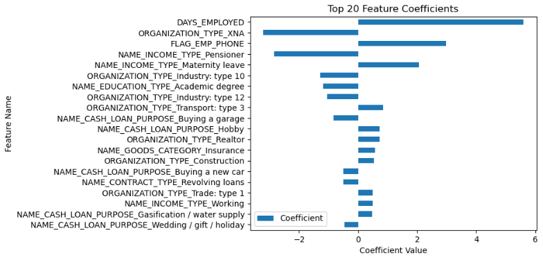

# Predictive Modeling for Risk Mitigation in Fintech

**Author**
Nick Gratzick

Note: To run workbook, please download the data to your machine and put into a data/ at the top level of the repo. Link to Kaggle is below in the document

Workbook:[My Analysis](analysis.ipynb "Analysis")

#### Executive summary
The ascent of Buy Now, Pay Later (BNPL) as a favored financial model among modern consumers is reshaping the landscape of retail and consumer finance. This innovative approach allows shoppers to defer payments with minimal to no interest, offering an appealing alternative to traditional credit. Its rising popularity underscores a pivotal shift towards more flexible and consumer-friendly payment solutions, particularly among younger demographics who value simplicity and transparency in their financial transactions.

Central to the operational excellence and sustainability of BNPL services is the sophisticated use of machine learning (ML) technologies, especially in the realm of risk assessment. ML's role transcends traditional analytical methods by providing deep insights into consumer behavior and creditworthiness, thus enabling BNPL providers to make informed, real-time decisions about loan approvals and terms. This advanced risk assessment capability is the linchpin for both securing financial health for providers and ensuring accessibility for consumers.

The implementation of ML in assessing and managing risk presents several compelling advantages:

**Enhanced Precision in Creditworthiness Evaluation**: ML algorithms analyze vast datasets, capturing nuances in consumer behavior that traditional credit scoring methods may overlook. This includes non-traditional data points such as transaction histories, browsing patterns, and payment behaviors, offering a holistic view of an individual's financial stability.

**Dynamic Risk Management**: By continuously learning from new data, ML models adapt and refine their predictions over time. This dynamic approach to risk assessment allows BNPL services to respond swiftly to changing market conditions and consumer behaviors, maintaining a balance between risk and opportunity.

**Fraud Detection and Prevention**: ML excels in identifying patterns indicative of fraudulent activity. Through real-time analysis, BNPL providers can detect and mitigate fraud risks before they escalate, protecting both their operations and their customers.

The benefits of leveraging ML for risk assessment extend directly to consumers, offering:

**Broader Financial Inclusion**: By utilizing a wider array of data for credit assessment, ML enables BNPL services to extend credit to consumers who might be excluded by traditional metrics, such as those with limited credit history.

**Personalized Financial Products**: ML's predictive power allows for the customization of payment plans and offers based on individual risk profiles and preferences, enhancing the customer experience.

**Trust and Transparency**: With ML-driven risk assessment, BNPL providers can offer clear, tailored terms to consumers, fostering trust and encouraging responsible financial behavior.

In summary, the integration of machine learning into risk assessment processes marks a significant evolution in the BNPL sector, driving financial innovation that benefits both providers and consumers. As ML technology advances, it promises to further refine risk assessment methodologies, paving the way for more secure, inclusive, and customer-centric financial services. The future of BNPL, powered by machine learning, is not just about offering flexible payment options but about creating a more nuanced, intelligent approach to financial risk and opportunity.

#### Rationale
With BNPL on the rise, effective risk assessment and management is crucial for maintaining financial stability, protecting customers from unsustainable debt, complying with regulations, improving profitability, and preventing economic crises. This question impacts both the financial sector's integrity and the overall economy's health, making it an essential question to answer.

#### Research Question
What predictive models or ML algorithms can be developed to assess and minimize the risk of financial loss in the banking and financial services industry?

#### Data Sources
Dataset: https://www.kaggle.com/datasets/gauravduttakiit/loan-defaulter

The dataset contins 1,413,700 rows and 158 columns of data relating to customer applications when applying for credit. The target variable is a binary classification of the outcome of whether or not the customer had repayment difficulties.

1 - client with payment difficulties: he/she had late payment more than X days on at least one of the first Y installments of the loan in our sample 
0 - all other cases

**Exploratory Data Analysis**

**Cleaning and Preperation**
After removing all columns that are missing more than 50% of its data, I then removed some useless identifiers and I remove gender. I want the model to be compliant for actual decisioning in a business setting and in order to be unbiased to gender, that will be omitted. Then after dropping all rows missing any values, I am left with my final dataset to continue with.

**Pre-Processing**
For my numerical data, I ran it though a standard scaler and incorporated PolynomialFeatures to see if any combination of feature turned useful. 

For my catagorical data, I OneHotEncoded it which significantly increased the dimensionality of my dataset.

#### Methodology
I plan to begin by fitting a logistic regression model, not only to establish a baseline but also to identify critical features. Subsequently, I will narrow the dataset to retain only the 20 most impactful features. Leveraging this refined dataset, I aim to build and test several additional models. The comparative analysis will include Support Vector Machines (SVM), Random Forest, K-Nearest Neighbors (KNN), Naive Bayes, and a logistic regression model that incorporates Polynomial Features for enhanced feature interaction exploration.

Upon determining the most effective model from these comparisons, I will further optimize it using GridSearchCV. This step aims to fine-tune the model's hyperparameters, ensuring the best possible performance.

#### Results

**Important Features**

    'DAYS_EMPLOYED', How many days before the application the person started current employment,time only relative to the application
    'FLAG_EMP_PHONE', Did client provide work phone (1=YES, 0=NO)
    'ORGANIZATION_TYPE', Type of organization where client works,
    'NAME_INCOME_TYPE', Clients income type (businessman, working, maternity leave,…)
    'NAME_EDUCATION_TYPE', Level of highest education the client achieved,
    'NAME_CASH_LOAN_PURPOSE', Purpose of the cash loan
    'NAME_GOODS_CATEGORY', What kind of goods did the client apply for in the previous application
    'CHANNEL_TYPE', Through which channel we acquired the client on the previous application
    'NAME_CONTRACT_TYPE',Identification if loan is cash or revolving

After evaluation Logistic Regression, Random Forrest, KNN, and Naive Bayes,the initial logistic regression model proved to be the most accurate with 91.4% accuracy score. The model revealed a set of key features that are most important in predicting financial behavior. Below is a brief overview of the most significant features from that model:

DAYS_EMPLOYED: The number of days the applicant has been employed prior to the loan application is a critical indicator of employment stability. A longer employment history suggests a steady income, which is a positive sign of the ability to repay loans. This is the most impactful feature.

FLAG_EMP_PHONE: Whether the applicant provided a work phone number can be an indicator of employment verification and stability. It adds a layer of credibility to the applicant's employment status.

ORGANIZATION_TYPE: The sector or type of organization where the applicant is employed may influence loan repayment capacity. Certain industries may offer more stability and higher income potential, affecting credit risk.

NAME_INCOME_TYPE: The applicant's source of income, whether from employment, business ventures, or other means such as maternity leave, provides insights into income reliability and risk profile.

NAME_EDUCATION_TYPE: The level of education achieved by the applicant often correlates with income potential and financial literacy. Higher education levels can indicate a lower risk of default. Having an academic degree is a good indicator the customer will repay.

NAME_CASH_LOAN_PURPOSE: Understanding the purpose of the loan is crucial in assessing how the funds will be used and the likelihood of repayment. Certain loan purposes may carry higher risk than others.

NAME_GOODS_CATEGORY: For previous applications, the type of goods the applicant applied for can indicate spending behavior and financial priorities, impacting their risk profile.

CHANNEL_TYPE: The acquisition channel through which the client was acquired for the previous application can reflect on the marketing strategies' effectiveness and possibly correlate with the client's financial behavior and preferences.

NAME_CONTRACT_TYPE: Whether the loan is cash or revolving, this feature provides insight into the loan structure preferred by the applicant, which can influence repayment behavior.

#### Next steps
The data has imbalanced target data, many more cases of good loans vs those with payment problems, so the classifier may be skewed with just luck based on this. Balancing the data more would provide more confidince in the outcomes of the model.

Including credit report data into this set would make it stronger and provide more solid indicators to the model for predicting.

Includeing additional data on what the customer is actually financing, if there are significant dates, or possibly locations where the funds would be used could provide useful data for determining risk.
